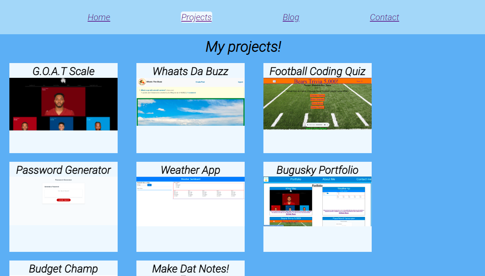

# ReactPortfolio
This is my portfolio that I used making React. I really like using React especially with the single page application. It gives such an a great user experience with page navigation. Reading up online was tricky with the newer updates to react and it seems like the community hasn’t caught up to the new syntax. I particularly like the new component form of coding that the newer for of React allows. I used it to create my blog posts and for my projects sections as they are broken down into smaller pieces. 

## Deployed site: https://k-bugz.github.io/ReactPortfolio/

## Author: Kevin Bugusky

## Contact Me
**Phone/SMS**: [(737)703-8407](tel:+17377038407/)  
**Email**: [kbugusky@gmail.com](mailto:kbugusky@gmail.com)  
**GitHub**: [@K-Bugz](https://www.github.com/K-Bugz)  
**LinkedIn**: [kevinbugusky333454](www.linkedin.com/in/kevinbugusky333454)

## License

